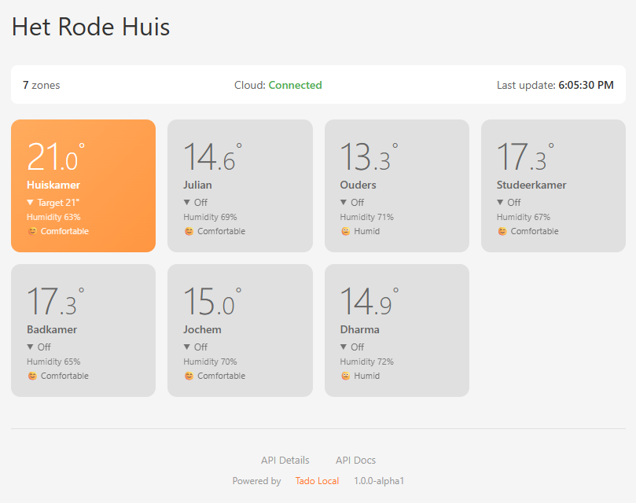
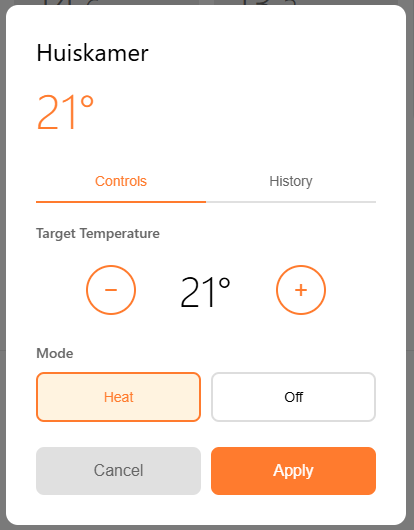
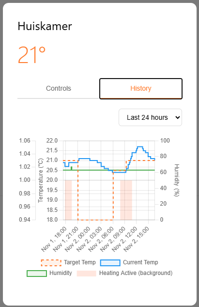

# Tado Local

**A REST API backend for local Tado thermostat control** - No cloud dependencies, no rate limits, instant response times.

[](https://github.com/ampscm/TadoLocal/actions/workflows/ci.yml)
[](LICENSE)
[](https://www.python.org/downloads/)

## 🎯 What is Tado Local?

Tado Local is a **REST API backend** that connects your Tado smart heating system directly to your home automation platform. It serves as the common integration layer for multiple smart home systems.

### Core Features

- **⚡ REST API** - Clean HTTP endpoints for any integration (Domoticz, Home Assistant, openHAB, Node-RED, etc.)
- **🔄 Real-time Updates** - Server-Sent Events (SSE) stream for instant state changes
- **💾 Local Storage** - SQLite database with complete state history (10-second resolution)
- **🔌 Direct Local Control** - HomeKit protocol communication with your Tado bridge - no cloud required
- **📊 Setup & Debug UI** - Web interface for initial configuration and troubleshooting
- **🔧 Interactive API Docs** - Built-in Swagger UI at `/docs`

### Why Choose Local Control?

Tado's cloud API has strict rate limits that can break home automation integrations. Traditional solutions require running full Home Assistant instances just to access one device.

**Tado Local changes that.** Using the HomeKit protocol built into your Tado bridge, this tool provides a fast, reliable REST API backend that works with any platform. Set it up once, integrate everywhere.

---

## � Quick Start

**Step 1: Install**

```bash
# Clone the repository
git clone https://github.com/ampscm/TadoLocal.git
cd TadoLocal

# Install (requires Python 3.11+)
pip install -e .
```

**Step 2: First-Time Setup**

Find your bridge information:
- **Bridge IP Address**: Check your router's connected devices list for "Tado"
- **HomeKit PIN**: Found on a sticker on your Tado bridge (format: XXX-XX-XXX)

Start the server:
```bash
tado-local --bridge-ip 192.168.1.100 --pin 123-45-678
```

**Step 3: Complete Cloud Authentication**

1. Open your browser to `http://localhost:4407`
2. Check the **Cloud** status in the web interface
3. If authentication is needed, click the "Authenticate" link
4. Log in with your Tado account credentials
5. Done! The setup UI will show all systems are connected

**Step 4: Integrate with Your Platform**

The REST API is now running at `http://localhost:4407`

- **API Documentation**: Visit `http://localhost:4407/docs` for interactive Swagger UI
- **Domoticz**: Install the included plugin from `domoticz/` directory (see [Domoticz Integration](#domoticz-plugin-installation))
- **Home Assistant**: Use REST integration (see [Home Assistant Integration](#home-assistant-integration))
- **Custom Integration**: Use any HTTP client to call the API endpoints

**Next runs**: Just `tado-local` - no arguments needed!

---

## 📡 REST API - The Integration Layer

Tado Local provides a comprehensive REST API designed to be the common backend for all your smart home integrations.

**Base URL**: `http://localhost:4407`

### Key Endpoints

```bash
# Get all zones with current state
GET /zones

# Get specific zone details
GET /zones/{zone_id}

# Get all thermostats
GET /thermostats

# Set target temperature
POST /thermostats/{thermostat_id}/set_temperature
Content-Type: application/json
{"temperature": 21.5}

# Get historical data (last 24 hours by default)
GET /zones/{zone_id}/history?start_time={unix_timestamp}&limit=1000

# Real-time event stream (Server-Sent Events)
GET /events

# System status
GET /status
```

**Complete API Documentation**: `http://localhost:4407/docs` (interactive Swagger UI with try-it-now functionality)

### Integration Examples

#### Python

```python
import requests

TADO_API = "http://localhost:4407"

# Get all zones
zones = requests.get(f"{TADO_API}/zones").json()['zones']

for zone in zones:
    state = zone['state']
    print(f"{zone['name']}: {state['cur_temp_c']}°C (target: {state['target_temp_c']}°C)")

# Set temperature
requests.post(
    f"{TADO_API}/zones/1/set",
    json={"temperature": 22.0}
)
```

#### curl

```bash
# Get current state
curl http://localhost:4407/zones

# Set temperature
curl -X POST http://localhost:4407/thermostats/1/set_temperature \
  -H "Content-Type: application/json" \
  -d '{"temperature": 21.5}'

# Stream live updates
curl -N http://localhost:4407/events
```

---

## 🏗️ Platform Integrations

### Domoticz Plugin Installation

**Native plugin included!** Located in the `domoticz/` directory.

#### Installation Steps:

1. **Copy the plugin to Domoticz**:
   ```bash
   cd /path/to/domoticz/plugins
   mkdir TadoLocal
   cp /path/to/tado-local/domoticz/plugin.py TadoLocal/
   ```

2. **Restart Domoticz**:
   ```bash
   sudo systemctl restart domoticz
   ```

3. **Configure in Domoticz Web UI**:
   - Navigate to: **Setup → Hardware**
   - Click **Add** and select **Tado Local** from the Type dropdown
   - Enter your Tado Local API URL (e.g., `http://localhost:4407`)
   - Set retry interval (default: 30 seconds)
   - Click **Add**

4. **Devices auto-created!**
   - The plugin automatically discovers all your zones
   - Each zone appears as a Temperature + Humidity device
   - Real-time updates via Server-Sent Events (SSE)

**Features**:
- ✅ Automatic zone discovery
- ✅ Real-time temperature and humidity updates
- ✅ Thermostat control (set temperature, on/off)
- ✅ Auto-reconnect on connection loss
- ✅ Detailed debug logging

**Full documentation**: See [`domoticz/README.md`](domoticz/README.md)

### Home Assistant Integration

Integrate using the REST platform:

```yaml
# configuration.yaml

sensor:
  - platform: rest
    name: "Living Room Temperature"
    resource: "http://localhost:4407/zones/1"
    value_template: "{{ value_json.current_temperature }}"
    unit_of_measurement: "°C"

climate:
  - platform: generic_thermostat
    name: "Living Room Heating"
    # Configure with REST commands
```

**Want a native HACS integration?** We'd love your contribution! The REST API is ready.

### Other Platforms

The REST API works with any platform that supports HTTP:
- **openHAB**: Use HTTP binding
- **Node-RED**: HTTP request nodes
- **HomeBridge**: HTTP webhooks
- **ioBroker**: REST adapter
- **Custom Scripts**: Any language with HTTP support

---

## 🖥️ Web Interface (Setup & Debug Tool)

While the REST API is the primary interface for integrations, Tado Local includes a web UI for initial setup, configuration verification, and troubleshooting.

**Access**: `http://localhost:4407`

### Use Cases

- **Initial Setup**: Complete cloud authentication and verify bridge connection
- **Debugging**: Check real-time connection status, view current readings
- **Historical Analysis**: View temperature trends, humidity, and heating patterns over time
- **Manual Control**: Directly adjust temperatures when testing or troubleshooting
- **Feature Demo**: Visual representation of capabilities for integration planning

### Screenshots

#### Setup & Status View

*Monitor connection status and verify all zones are discovered*

#### Manual Control (Debug Mode)

*Direct temperature control for testing*

#### Historical Data Visualization

*Interactive charts showing data available via the history API endpoint*

**Note**: Most users will interact with Tado Local through their smart home platform (Domoticz, Home Assistant, etc.) rather than the web UI.

---

## ⚠️ Alpha Status

**This project is currently in active alpha development.** The REST API is stable and functional, but expect:
- Occasional API refinements as we gather feedback from integrators
- UI improvements for setup and debugging
- Enhanced documentation based on real-world usage

**We welcome integrators!** If you're building a plugin for a new platform, we're here to help. Please report any issues on [GitHub Issues](https://github.com/ampscm/TadoLocal/issues).

---

## ✨ Features

**API & Integration**
- Clean REST API with comprehensive endpoints
- Real-time Server-Sent Events (SSE) stream
- Interactive Swagger UI documentation at `/docs`
- State history with 10-second resolution
- Zone and device management
- Cross-platform compatibility (Windows, Linux, FreeBSD)

**Backend Capabilities**
- Direct local HomeKit protocol communication
- Hybrid architecture: local control + cloud metadata sync
- SQLite persistence (state, history, credentials)
- Automatic reconnection handling
- No rate limits on local operations

**Setup & Debug Tools**
- Web UI for initial configuration
- Connection status monitoring
- Historical data visualization
- Manual control interface

---

## 📋 Installation & Configuration

### Prerequisites

- **Python 3.11 or newer** ([Download](https://www.python.org/downloads/))
  - Required for modern async/await syntax and performance improvements

- **Tado Internet Bridge** with HomeKit support (V3+ models)
  - Must have HomeKit functionality (look for the HomeKit logo on the device)
  - Check the label on your bridge for the HomeKit PIN (format: XXX-XX-XXX)

- **Network access** to your Tado bridge
  - Bridge and the server running Tado Local must be on the same network
  - You'll need to know the bridge's IP address (check your router's device list)

### Installation Steps

```bash
# Clone the repository
git clone https://github.com/ampscm/TadoLocal.git
cd TadoLocal

# Install the package
pip install -e .

# Verify installation
tado-local --help
```

### First-Time Setup

1. **Reset HomeKit pairing** on your bridge (see [Important Limitation](#-important-limitation) below)

2. **Start with your bridge credentials**:
   ```bash
   tado-local --bridge-ip 192.168.1.100 --pin 123-45-678
   ```

3. **Complete cloud authentication** in your browser (for device metadata)

4. **Done!** Future runs only need:
   ```bash
   tado-local
   ```

### Configuration Options

```bash
tado-local --help

Options:
  --state PATH          Path to state database (default: ~/.tado-local.db)
  --bridge-ip IP        IP address of the Tado bridge
  --pin XXX-XX-XXX      HomeKit PIN for initial pairing
  --port PORT           API server port (default: 4407)
  --clear-pairings      Clear all existing pairings before starting
```

### Optional Authentication

You can optionally secure the REST API with one or more Bearer tokens. This is useful for:
- Adding basic security when exposing the API on your local network
- Distinguishing between different clients (each gets its own key)
- Revoking access by removing specific keys

```bash
# Single API key via environment variable
export TADO_API_KEYS=your-secret-key
tado-local

# Multiple API keys (space-separated)
export TADO_API_KEYS="key-for-domoticz key-for-home-assistant key-for-testing"
tado-local

# Or as a single line
TADO_API_KEYS="key1 key2 key3" tado-local
```

When authentication is enabled:
- All API endpoints require `Authorization: Bearer <your-key>` header
- Any of the configured keys will be accepted
- Web UI (`/` and `/static/*`) remains accessible without authentication
- Provides basic protection on local networks (not cryptographically secure over HTTP)

Configure your clients (Domoticz plugin, Home Assistant, custom scripts, etc.) with one of the API keys to authenticate requests.

**Note**: If `TADO_API_KEYS` is not set or empty, authentication is disabled and all endpoints are publicly accessible.

---

## 🛠️ Advanced API Usage

### Get Historical Data

```bash
# Last 24 hours (default)
curl http://localhost:4407/zones/1/history

# Custom time range (Unix timestamps)
curl "http://localhost:4407/zones/1/history?start_time=1699000000&end_time=1699086400"

# With pagination
curl "http://localhost:4407/zones/1/history?limit=500&offset=500"
```

### Monitor Real-Time Events

```bash
# Stream live updates (Server-Sent Events)
curl -N http://localhost:4407/events
```

### Python Integration Example

```python
import requests
from datetime import datetime, timedelta

TADO_API = "http://localhost:4407"

# Get all zones with current state
response = requests.get(f"{TADO_API}/zones").json()
zones = response['zones']

for zone in zones:
    state = zone['state']
    print(f"{zone['name']}: {state['cur_temp_c']}°C")
    print(f"  Target: {state['target_temp_c']}°C")
    print(f"  Humidity: {state['hum_perc']}%")
    print(f"  Heating: {'ON' if state['cur_heating'] == 1 else 'OFF'}")
    print()

# Set temperature for a specific zone
requests.post(
    f"{TADO_API}/zones/1/set",
    json={"temperature": 22.0}
)

# Get history for the last 7 days
end_time = int(datetime.now().timestamp())
start_time = int((datetime.now() - timedelta(days=7)).timestamp())

history = requests.get(
    f"{TADO_API}/zones/1/history",
    params={"start_time": start_time, "end_time": end_time, "limit": 1000}
).json()

for record in history['history']:
    print(f"{record['timestamp']}: {record['state']['cur_temp_c']}°C")
```

---

## 🔌 Using the Web Interface

Once Tado Local is running, open your browser to `http://localhost:4407` for setup and debugging.

**Primary uses**:
- Initial cloud authentication
- Connection status verification
- Manual testing and debugging
- Historical data visualization

**For day-to-day use**, interact with Tado Local through your smart home platform's integration rather than the web UI.

---

## ⚠️ Important Limitation

## 🏗️ For Developers & Integrators

### REST API Integration

Tado Local provides a comprehensive REST API for integrating with any smart home platform.

**Base URL**: `http://localhost:4407`

**Key Endpoints**:

```bash
# Get all zones with current state
GET /zones

# Get all thermostats
GET /thermostats

# Get history for a zone (last 24 hours by default)
GET /zones/{zone_id}/history?start_time={unix_timestamp}&limit=1000

# Set target temperature
POST /thermostats/{thermostat_id}/set_temperature
Content-Type: application/json
{"temperature": 21.5}

# Real-time event stream
GET /events
```

**Full API Documentation**: `http://localhost:4407/docs` (interactive Swagger UI)

### Domoticz Plugin Installation

**Good news - we have a native Domoticz plugin!** It's included in the `domoticz/` directory of this repository.

#### Installation Steps:

1. **Copy the plugin to Domoticz**:
   ```bash
   cd /path/to/domoticz/plugins
   mkdir TadoLocal
   cp /path/to/tado-local/domoticz/plugin.py TadoLocal/
   ```

2. **Restart Domoticz**:
   ```bash
   sudo systemctl restart domoticz
   ```

3. **Configure in Domoticz Web UI**:
   - Navigate to: **Setup → Hardware**
   - Click **Add** and select **Tado Local** from the Type dropdown
   - Enter your Tado Local API URL (e.g., `http://localhost:4407`)
   - Set retry interval (default: 30 seconds)
   - Click **Add**

4. **Devices auto-created!**
   - The plugin automatically discovers all your zones
   - Each zone appears as a Temperature + Humidity device
   - Real-time updates via Server-Sent Events (SSE)

#### Features:
- ✅ Automatic zone discovery
- ✅ Real-time temperature and humidity updates
- ✅ Thermostat control (set temperature, on/off)
- ✅ Auto-reconnect on connection loss
- ✅ Detailed debug logging

**Full documentation**: See [`domoticz/README.md`](domoticz/README.md) for troubleshooting and advanced configuration.

### Home Assistant Integration

You can integrate Tado Local with Home Assistant using the REST integration:

```yaml
# configuration.yaml

sensor:
  - platform: rest
    name: "Living Room Temperature"
    resource: "http://localhost:4407/zones/1"
    value_template: "{{ value_json.current_temperature }}"
    unit_of_measurement: "°C"

climate:
  - platform: generic_thermostat
    name: "Living Room Heating"
    # Configure with REST commands
```

**Contributions welcome!** If you'd like to build a native Home Assistant integration or HACS addon, we'd be happy to review PRs.

### Other Platforms

The REST API works with any platform that supports HTTP requests:
- **openHAB**: Use HTTP binding
- **Node-RED**: HTTP request nodes
- **HomeBridge**: HTTP webhooks
- **Custom Scripts**: Python, JavaScript, bash + curl

---

## 📋 Installation & Configuration

### Prerequisites

### Prerequisites

- **Python 3.11 or newer** ([Download](https://www.python.org/downloads/))
  - Required for modern async/await syntax and performance improvements

- **Tado Internet Bridge** with HomeKit support (V3+ models)
  - Must have HomeKit functionality (look for the HomeKit logo on the device)
  - Check the label on your bridge for the HomeKit PIN (format: XXX-XX-XXX)

- **Network access** to your Tado bridge
  - Bridge and the computer running Tado Local must be on the same network
  - You'll need to know the bridge's IP address (check your router's device list)

### Installation Steps

```bash
# Clone the repository
git clone https://github.com/ampscm/TadoLocal.git
cd TadoLocal

# Install the package
pip install -e .

# Verify installation
tado-local --help
```

### First-Time Setup

1. **Reset HomeKit pairing** on your bridge (see [Important Limitation](#-important-limitation) below)

2. **Start with your bridge credentials**:
   ```bash
   tado-local --bridge-ip 192.168.1.100 --pin 123-45-678
   ```

3. **Complete cloud authentication** in your browser (for device metadata)

4. **Done!** Future runs only need:
   ```bash
   tado-local
   ```

### Configuration Options

### Configuration Options

```bash
tado-local --help

Options:
  --state PATH          Path to state database (default: ~/.tado-local.db)
  --bridge-ip IP        IP address of the Tado bridge
  --pin XXX-XX-XXX      HomeKit PIN for initial pairing
  --port PORT           API server port (default: 4407)
  --clear-pairings      Clear all existing pairings before starting
```

---

## 🔌 Using the Web Interface

Once Tado Local is running, open your browser to `http://localhost:4407`

### Main Features:

- **📊 Zone Dashboard**: See all your rooms with current temperature, humidity, and heating status
- **🎛️ Zone Controls**: Click any zone to adjust target temperature and heating mode
- **📈 History Charts**: View temperature trends, humidity, and heating activity over time (24h, 7d, 30d, 1y)
- **☁️ Status Bar**: Monitor connection status to both the bridge and cloud API
- **🔄 Real-time Updates**: The interface updates automatically as temperatures change

---

## 🛠️ API Usage Examples

### Get Current State

```bash
# All thermostats
curl http://localhost:4407/thermostats

# Specific zone
curl http://localhost:4407/zones/1

# System status
curl http://localhost:4407/status
```

### Control Temperature

```bash
# Set specific temperature (enables heating)
curl -X POST "http://localhost:4407/zones/1/set?temperature=21.5"

# Turn heating off (remembers previous value)
curl -X POST "http://localhost:4407/zones/1/set?temperature=0"

# Resume schedule (enable heating without changing target temperature)
curl -X POST "http://localhost:4407/zones/1/set?temperature=-1"

# Alternative: use explicit heating_enabled parameter
curl -X POST "http://localhost:4407/zones/1/set?heating_enabled=true"
curl -X POST "http://localhost:4407/zones/1/set?heating_enabled=false"
```

**Temperature control modes:**
- `temperature=-1` → Resume schedule/auto mode (turn on without changing target temp) - **Perfect for automation!**
- `temperature=0` → Turn heating off (without changing target temp)
- `temperature=5-30` → Set specific temperature and enable heating

**Smart defaults:**
- Setting `temperature=0` automatically implies `heating_enabled=false`
- Setting `temperature=-1` automatically implies `heating_enabled=true`
- Setting `temperature` >= 5 automatically implies `heating_enabled=true`
- You can override these by explicitly setting `heating_enabled`

**Why -1 and 0 are useful for automation:**
Both `-1` and `0` preserve the target temperature stored in Tado. This means:
- `temperature=0` turns heating **off** but remembers your setpoint
- `temperature=-1` turns heating **on** using the remembered setpoint
- Your Tado schedule remains intact - these are temporary overrides
- Perfect for "away mode" scripts that disable/re-enable heating without changing schedules

### Get History Data

```bash
# Last 24 hours
curl http://localhost:4407/zones/1/history

# Custom time range (Unix timestamps)
curl "http://localhost:4407/zones/1/history?start_time=1699000000&end_time=1699086400"

# With pagination
curl "http://localhost:4407/zones/1/history?limit=500&offset=500"
```

### Monitor Real-Time Events

```bash
# Stream live updates (Server-Sent Events)
curl -N http://localhost:4407/events
```

### Python Integration Example

```python
import requests
from datetime import datetime, timedelta

TADO_API = "http://localhost:4407"

# Get all zones
response = requests.get(f"{TADO_API}/zones").json()
zones = response['zones']

for zone in zones:
    state = zone['state']
    print(f"{zone['name']}: {state['cur_temp_c']}°C")
    print(f"  Target: {state['target_temp_c']}°C")
    print(f"  Humidity: {state['hum_perc']}%")
    print(f"  Heating: {'ON' if state['cur_heating'] == 1 else 'OFF'}")
    print()

# Set temperature for a specific zone
requests.post(
    f"{TADO_API}/zones/1/set",
    json={"temperature": 22.0}
)

# Get history for the last 7 days
end_time = int(datetime.now().timestamp())
start_time = int((datetime.now() - timedelta(days=7)).timestamp())

history = requests.get(
    f"{TADO_API}/zones/1/history",
    params={"start_time": start_time, "end_time": end_time, "limit": 1000}
).json()

for record in history['history']:
    print(f"{record['timestamp']}: {record['state']['cur_temp_c']}°C")
```

---

## ⚠️ Important Limitation

### Single HomeKit Connection

The Tado Internet Bridge hardware **only allows ONE HomeKit connection at a time**.

**Before using Tado Local**, you must:

1. **Remove existing HomeKit pairings** from:
   - iPhone/iPad Home app
   - Home Assistant HomeKit Controller
   - Other HomeKit applications

2. **OR reset the bridge's HomeKit configuration**:
   - Press and hold the small reset button on the back for **10+ seconds**
   - The LED will blink to confirm reset
   - See [Tado's official guide](https://support.tado.com/en/articles/3387334-how-can-i-reset-the-homekit-configuration-of-the-internet-bridge)

**Note**: This limitation is hardware-based. We may eventually expose Tado Local itself as a HomeKit bridge to work around this, but that's future work. Contributions welcome!

---

## 🐛 Troubleshooting

### "Device reports 'Unavailable' for pairing"

The bridge is already paired to another HomeKit controller. See [Important Limitation](#-important-limitation) above.

### Connection drops or "None" values

The proxy automatically reconnects and ignores temporary `None` values. Wait a few seconds for the connection to restore.

### Cloud authentication not working

1. Check that port 4407 is accessible in your browser
2. Visit `http://localhost:4407/status` to see the authentication URL
3. Make sure you're using the correct Tado account credentials

### Starting fresh

```bash
# Remove database and re-pair
rm ~/.tado-local.db

# Run initial setup again
tado-local --bridge-ip 192.168.1.100 --pin 123-45-678
```

---

## 🤝 Contributing

**We'd love your help!** This project aims to be the common REST API backend for all Tado integrations. Whether you're building a plugin, reporting bugs, or improving documentation, all contributions are welcome.

### Ways to Contribute

- **� Build integrations**: Create plugins for new smart home platforms using the REST API
- **�🐛 Report bugs**: [Open an issue](https://github.com/ampscm/TadoLocal/issues) with details
- **💡 API feedback**: Share what endpoints or features would help your integration
- **📝 Improve docs**: Add examples, clarify API usage, write integration guides
- **🔧 Enhance backend**: Improve the core API, add features, fix issues
- **🧪 Test**: Report compatibility issues across different platforms

### For Integration Developers

**Priority areas needing help**:

- [x] **Domoticz plugin** - ✅ Already available in `domoticz/` directory!
- [ ] **Home Assistant HACS integration** - Native HA component using the REST API
- [ ] **openHAB binding** - Java-based binding for openHAB users
- [ ] **Node-RED nodes** - Custom nodes for easy flow integration
- [ ] **ioBroker adapter** - Adapter for ioBroker platform
- [ ] **HomeBridge plugin** - Expose Tado devices via HomeKit
- [ ] **Docker container** - Simplify deployment with docker-compose

**Backend improvements needed**:

- [ ] **Test coverage** - Unit and integration tests
- [ ] **Multi-bridge support** - Handle multiple Tado systems
- [ ] **API versioning** - Ensure backward compatibility
- [ ] **WebSocket support** - Alternative to SSE for some integrations
- [ ] **Documentation improvements** - More API examples, tutorials

**Future exploration areas**:

- [ ] **Google Local Home API** - Direct Google Assistant integration
- [ ] **Matter protocol support** - As the standard matures
- [ ] **Multi-platform CI/CD** - Automated testing across Windows, Linux, macOS

### Development Setup

```bash
# Clone and install in development mode
git clone https://github.com/ampscm/TadoLocal.git
cd TadoLocal
pip install -e .[dev]

# Run with live reloading
python -m tado_local --bridge-ip 192.168.1.100

# Run tests (when available)
pytest

# Check code style
ruff check .
```

### API Development Guidelines

When building integrations:
1. Use the interactive Swagger docs at `http://localhost:4407/docs` to explore endpoints
2. Subscribe to `/events` SSE stream for real-time updates rather than polling
3. Handle connection errors gracefully - the backend auto-reconnects to the bridge
4. Respect the 10-second history resolution for efficient queries
5. Report any missing endpoints or API improvements needed

### Project Structure

```
tado_local/
├── __init__.py         # Package initialization
├── __main__.py         # CLI entry point
├── api.py              # Main TadoLocalAPI class
├── routes.py           # FastAPI REST endpoints (primary integration layer)
├── bridge.py           # HomeKit bridge communication
├── state.py            # Device state & history management
├── cache.py            # Characteristic caching
├── database.py         # SQLite schema
├── homekit_uuids.py    # UUID mappings
└── static/
    └── index.html      # Web UI (setup/debug tool)
```

---

## 🏗️ Architecture

### How It Works

```
┌─────────────────┐
│  Tado Bridge    │ ←─── HomeKit Protocol (local, fast, no rate limits)
│  (HomeKit)      │
└────────┬────────┘
         │
         ↓
┌─────────────────┐
│  Tado Local     │ ←─── Common REST API Backend
│  (This Project) │
└────────┬────────┘
         │
         ├──→ REST API (port 4407) ←─── Primary integration layer
         ├──→ Real-time Events (SSE)
         ├──→ Interactive Docs (/docs)
         ├──→ Web UI (setup/debug)
         └──→ SQLite Database (history & state)
                │
                ↓
         ┌──────────────────────────┐
         │  Your Smart Home         │
         │  Integrations:           │
         │  - Domoticz plugin       │
         │  - Home Assistant        │
         │  - openHAB               │
         │  - Node-RED              │
         │  - Custom applications   │
         └──────────────────────────┘
```

### Technology Stack

- **FastAPI**: Modern REST API with automatic OpenAPI documentation
- **aiohomekit**: HomeKit protocol implementation for local bridge communication
- **SQLite**: Persistent storage (history, credentials, state)
- **Uvicorn**: High-performance ASGI web server
- **Tado Cloud API**: Device metadata sync (battery status, zone names)
- **Python 3.11+**: Modern async/await for efficient I/O

### Data Flow

1. **Real-time updates**: HomeKit bridge → Tado Local → Your integration (via SSE or polling)
2. **Control commands**: Your integration → Tado Local REST API → HomeKit bridge → Tado devices
3. **History storage**: All state changes saved to SQLite with 10-second resolution
4. **Metadata sync**: Cloud API refreshed every 4 hours for battery status and zone names

---

## 📄 License

**Apache License 2.0** - see [LICENSE](LICENSE) file for full text.

### What This Means

This project is **free and open source** software. You can:
- ✅ Use it for personal or commercial purposes
- ✅ Modify and distribute it
- ✅ Build integrations and plugins on top of it
- ✅ Include it in proprietary software
- ✅ Use it in any context without restrictions

**No attribution required** (but appreciated!)

### For Integration Developers

All dependencies use permissive open source licenses compatible with Apache 2.0:

| Dependency | License | Purpose |
|------------|---------|---------|
| **aiohomekit** | Apache-2.0 | HomeKit protocol implementation |
| **fastapi** | MIT | REST API framework |
| **uvicorn** | BSD-3-Clause | ASGI web server |
| **cryptography** | Apache-2.0 OR BSD-3-Clause | Cryptographic operations |
| **zeroconf** | LGPL-2.1-or-later | mDNS service discovery (optional) |
| **aiohttp** | Apache-2.0 AND MIT | HTTP client for cloud API |

**You can freely**:
- Build commercial plugins for smart home platforms
- Integrate into proprietary home automation systems
- Fork and customize for specific use cases
- Redistribute as part of larger projects

---

## 🙏 Acknowledgments

- Built on [aiohomekit](https://github.com/Jc2k/aiohomekit) - Excellent HomeKit protocol library
- Inspired by [Home Assistant](https://www.home-assistant.io/) and [Domoticz](http://domoticz.com) communities
- Thanks to everyone who reverse-engineered the Tado and HomeKit protocols

---

## 💬 Support & Community

- **🐛 Bug Reports**: [GitHub Issues](https://github.com/ampscm/TadoLocal/issues)
- **� Integration Help**: [GitHub Discussions](https://github.com/ampscm/TadoLocal/discussions)
- **📖 API Docs**: `http://localhost:4407/docs` (interactive documentation when running)

---

## 🎯 Roadmap

### Current Status: **Alpha**

✅ **Core Backend Ready**:
- Stable REST API with comprehensive endpoints
- Real-time Server-Sent Events (SSE) stream
- Interactive OpenAPI/Swagger documentation
- Local HomeKit control with auto-reconnection
- SQLite persistence and history tracking
- **Native Domoticz plugin** (see `domoticz/` directory)
- Hybrid local + cloud architecture
- **Cross-platform**: Windows, FreeBSD, Linux

🚧 **Integration Priorities**:
- Home Assistant HACS component
- openHAB binding
- Node-RED custom nodes
- Docker container for easier deployment
- More integration examples and tutorials

🔧 **Backend Improvements**:
- Comprehensive test coverage
- API versioning for stability
- Multi-bridge support
- WebSocket alternative to SSE
- Enhanced CI/CD across platforms

🔮 **Future Exploration**:
- **Google Local Home API** - Direct Google Assistant integration
- **Matter protocol support** - As the standard matures
- **HomeKit bridge re-exposure** - Work around single-connection limit
- **GraphQL API** - Alternative query interface for complex integrations

---

**Ready to integrate?** Jump to [Quick Start](#-quick-start) or explore the [API documentation](http://localhost:4407/docs)!

**Building a plugin?** Check out the [Domoticz plugin](domoticz/) as a reference implementation, and reach out in [Discussions](https://github.com/ampscm/TadoLocal/discussions) for help!

